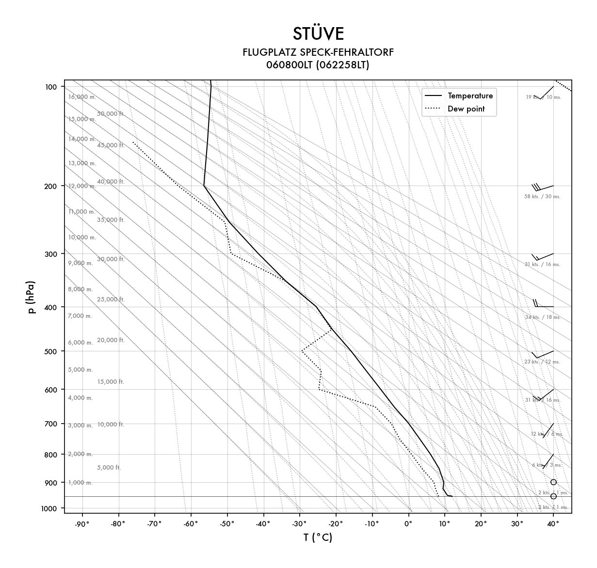

<p align="center">
  
</p>

# Stüve diagram

Generates [Stüve](https://en.wikipedia.org/wiki/St%C3%BCve_diagram) and
[Skew-T log-P](https://en.wikipedia.org/wiki/Skew-T_log-P_diagram) diagrams for a
given location using the [Open-Meteo](https://open-meteo.com/) pressure-level
forecast. Aimed at soaring flight planning.

## Example



## What it does

For a given location, on each run it:

- Geocodes the location name (Nominatim / OpenStreetMap) into coordinates.
- Fetches the Open-Meteo GFS forecast (temperature, humidity, geopotential height and wind at every pressure level, plus the surface and the daily maximum temperature).
- Renders the morning sounding (07 local time) of the chosen day — today by default, or tomorrow with `--tomorrow` — with temperature and dew-point profiles, wind barbs (with speeds in kt and m/s), altitude scales in metres and feet, and the adiabat / mixing-ratio background.
- Overlays the Tmax parcel ascent: a dry adiabat lifted from the forecast maximum temperature and the parcel's mixing-ratio line, marking the thermal top (and the cloud base, when cumulus form) for soaring flight planning.
- Draws the same sounding as both a Stüve and a Skew-T log-P diagram, which differ only in the coordinate projection.

Diagrams are written to `./output/` as `<stuve|skewt>-<location>-<date>-<HHMM>LT.png`.

## Requirements

- Python 3.7+
- `matplotlib`, `pandas`, `numpy`
- Internet access (Nominatim + Open-Meteo)

```bash
pip install matplotlib pandas numpy
```

## Usage

```bash
make LOCATION="Flugplatz Speck-Fehraltorf" today
make LOCATION="Flugplatz Speck-Fehraltorf" tomorrow
```

## Configuration

The location is required and passed on the command line:

```bash
python -m src.stuve --location "Flugplatz Speck-Fehraltorf"
```

Other settings live in `src/config/constants.py` (plot bounds, figure size,
output directory).

Other domain constants:

- `src/sounding/constants.py` — `TARGET_HOUR_LOCAL`, Open-Meteo model/levels, geocoder.
- `src/rendering/constants.py` — styling (fonts, barbs, labels, title, parcel) and the Skew-T skew/limits.
- `src/thermodynamics/constants.py` — physical constants and grid sampling.

## Project structure

```
src/
  stuve.py                Entry point: orchestrates the pipeline
  config/                 Shared diagram bounds, app configuration, font style
  sounding/               Data sources: geocode, fetch Open-Meteo, build sounding,
                          select the morning hour
  thermodynamics/         Pressure coordinate, dew point, adiabatic field grid,
                          Tmax parcel ascent
  rendering/              Background, profiles, parcel, altitude labels, wind barbs,
                          axes, subtitle, the Stüve/Skew-T projections, and the
                          diagram compositor
  helpers/                Cross-cutting utilities (e.g. filename-safe slugs)
```

Pipeline: `geocode → fetch → select morning hour → build sounding → parcel ascent → render`
(the adiabatic field grid is computed inside the background drawing).

## Testing

Co-located unit tests (`*_test.py`) next to the code they cover:

```bash
make test
```
